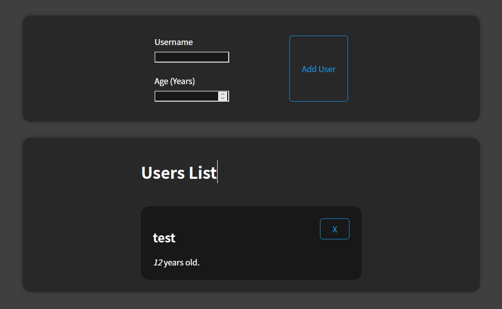
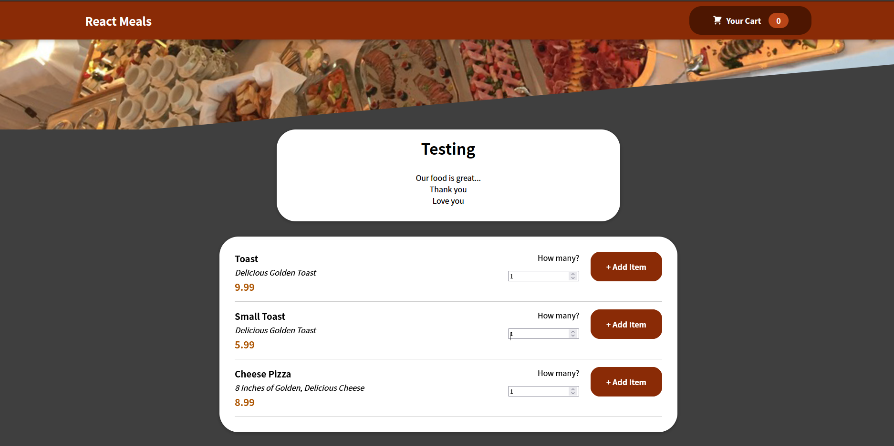
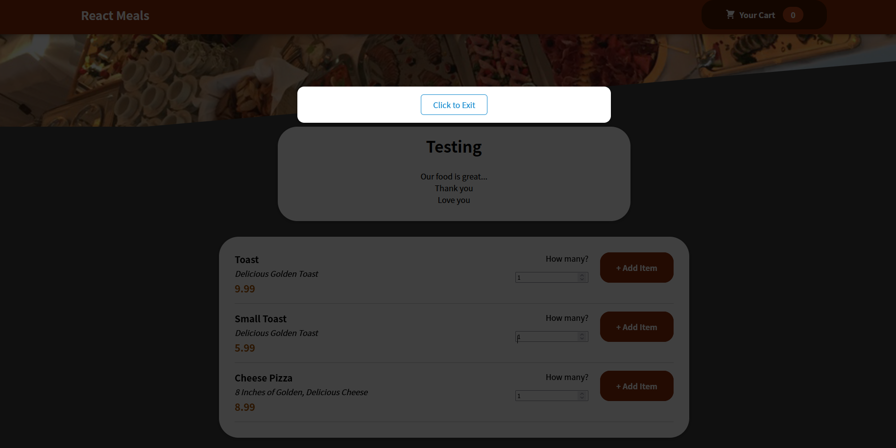

# Project Redos

Welcome to my redo repo. This repository contains a few projects that I made following the completion of the Course 'React - The Complete Guide'. I attempted to redo the projects with the new knowledge that I had acquired from watching further but only with the technologies covered up to that point.

## 01

This project is a simple List showing app with a form. It allows adding and removing Users (both done via prop drilling).

## 02

This project is slightly more complex than the last. It features a shopping cart with items that are pulled from a firebase realtime database. To do this, it utilizes several react concepts, such as Contexts, Reducers, and Portals.
 
The following showcases the initial state of the webpage, after the items load:

 
The following showcases the empty cart feature:

 
The following showcases a Cart filled with items:

 
